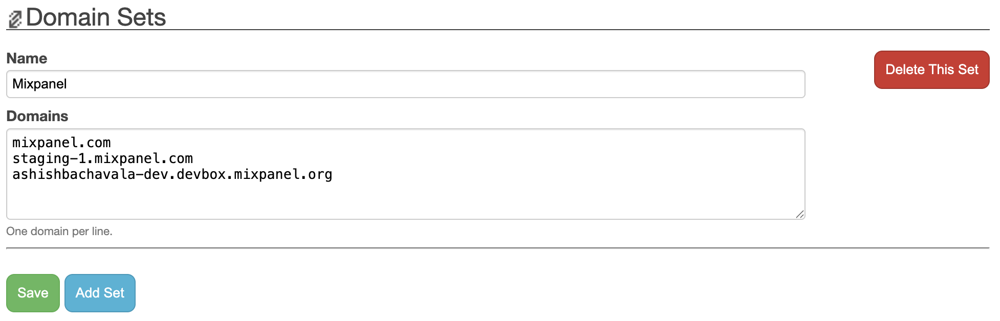
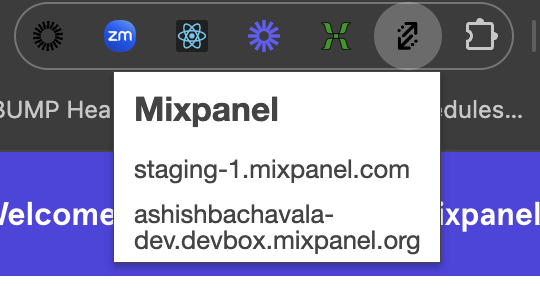

> Anyone know of a Chrome extension that keeps the current path but toggles through a list of development/test/staging domains?
>
> [@zachleat](https://twitter.com/zachleat/status/337631500931588096)

No, but we can build one!

# Info

I forked this from an old repo and updated it to work with chrome extensions manifest v3.

I find it very useful for quickly opening an account on my devbox or a different environment to repro an issue.

# Status

This is not complete, it's not efficient, but it works.

# Usage

1. Enable chrome developer mode
1. Install unpacked extension from the `google-chrome-domain-swap` folder
1. Visit the options page
1. Add a domain set and save it
    
   
1. Visit one of the sites in the domain set
1. Click the button on your extension bar
    
   
1. Use the links to jump to another domain with the same path
1. Find some bugs, or clean up the code, then open a pull request

# License

MIT
